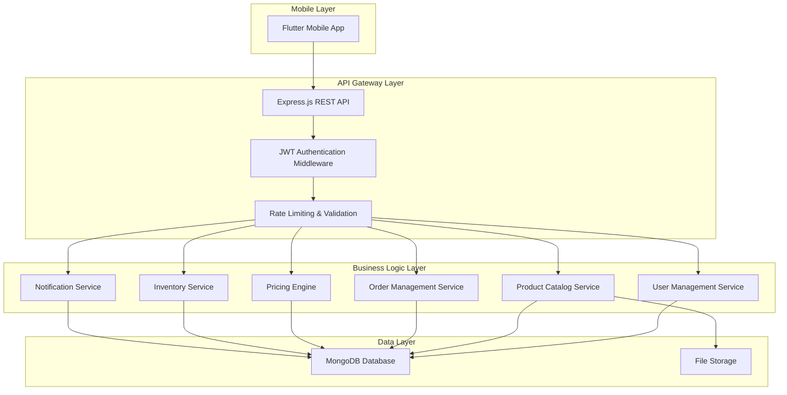

# Design Document: Wholesale E-Commerce App

## Overview

The wholesale e-commerce application is a comprehensive mobile-first platform designed for a wholesale mobile accessories company. The system follows a modern three-tier architecture with a Node.js/Express.js backend, MongoDB database, and Flutter mobile frontend. The application supports multi-tier pricing, role-based access control, real-time order tracking, and comprehensive inventory management.

The architecture emphasizes scalability, security, and user experience, drawing inspiration from successful e-commerce platforms like Temu and SHEIN while incorporating specialized wholesale business logic.

## Architecture

### System Architecture Pattern
The application follows a **layered architecture** pattern with clear separation of concerns:



### Technology Stack
- **Backend**: Node.js with Express.js framework
- **Database**: MongoDB with Mongoose ODM
- **Authentication**: JWT (JSON Web Tokens)
- **Mobile Frontend**: Flutter (Dart)
- **State Management**: BLoC pattern for Flutter
- **File Storage**: GridFS or cloud storage for product images
- **Real-time Updates**: WebSocket connections for order tracking

## Components and Interfaces

### Backend Components

#### 1. Authentication Service
```typescript
interface AuthService {
  register(userData: UserRegistrationData): Promise<AuthResult>
  login(credentials: LoginCredentials): Promise<AuthResult>
  validateToken(token: string): Promise<UserPayload>
  refreshToken(refreshToken: string): Promise<AuthResult>
}

interface AuthResult {
  success: boolean
  token?: string
  refreshToken?: string
  user?: UserProfile
  error?: string
}
```

#### 2. User Management Service
```typescript
interface UserManagementService {
  createUser(userData: CreateUserData): Promise<User>
  updateUser(userId: string, updates: UserUpdates): Promise<User>
  getUserById(userId: string): Promise<User>
  assignRole(userId: string, role: UserRole): Promise<boolean>
  deactivateUser(userId: string): Promise<boolean>
}

enum UserRole {
  ADMIN = 'admin',
  EMPLOYEE = 'employee',
  CUSTOMER = 'customer'
}
```

#### 3. Product Catalog Service
```typescript
interface ProductCatalogService {
  createProduct(productData: CreateProductData): Promise<Product>
  updateProduct(productId: string, updates: ProductUpdates): Promise<Product>
  getProducts(filters: ProductFilters): Promise<ProductList>
  searchProducts(query: string): Promise<ProductList>
  deleteProduct(productId: string): Promise<boolean>
}

interface Product {
  id: string
  name: string
  description: string
  category: string
  images: string[]
  retailPrice: number
  wholesalePrice: number
  inventory: number
  sku: string
  specifications: Record<string, any>
  createdAt: Date
  updatedAt: Date
}
```

#### 4. Pricing Engine
```typescript
interface PricingEngine {
  calculatePrice(productId: string, userType: UserRole, discountCode?: string): Promise<PriceResult>
  validateDiscountCode(code: string): Promise<DiscountValidation>
  applyBulkDiscount(items: CartItem[], userType: UserRole): Promise<BulkPriceResult>
}

interface PriceResult {
  originalPrice: number
  finalPrice: number
  discountApplied: number
  discountType: 'wholesale' | 'bulk' | 'promotional'
}
```

#### 5. Order Management Service
```typescript
interface OrderManagementService {
  createOrder(orderData: CreateOrderData): Promise<Order>
  updateOrderStatus(orderId: string, status: OrderStatus): Promise<Order>
  getOrderById(orderId: string): Promise<Order>
  getUserOrders(userId: string): Promise<OrderList>
  trackOrder(orderId: string): Promise<OrderTracking>
}

enum OrderStatus {
  PENDING = 'pending',
  CONFIRMED = 'confirmed',
  PROCESSING = 'processing',
  SHIPPED = 'shipped',
  DELIVERED = 'delivered',
  CANCELLED = 'cancelled'
}
```

#### 6. Inventory Service
```typescript
interface InventoryService {
  updateStock(productId: string, quantity: number): Promise<InventoryUpdate>
  checkAvailability(productId: string, requestedQuantity: number): Promise<boolean>
  reserveStock(items: CartItem[]): Promise<ReservationResult>
  releaseReservation(reservationId: string): Promise<boolean>
  getLowStockAlerts(): Promise<LowStockAlert[]>
}
```

### Frontend Components (Flutter)

#### 1. Authentication Module
```dart
abstract class AuthRepository {
  Future<AuthResult> login(String email, String password);
  Future<AuthResult> register(UserRegistrationData userData);
  Future<void> logout();
  Future<bool> isAuthenticated();
  Stream<AuthState> get authStateStream;
}

class AuthBloc extends Bloc<AuthEvent, AuthState> {
  final AuthRepository authRepository;
  // BLoC implementation for authentication state management
}
```

#### 2. Product Catalog Module
```dart
abstract class ProductRepository {
  Future<List<Product>> getProducts({ProductFilters? filters});
  Future<List<Product>> searchProducts(String query);
  Future<Product> getProductById(String productId);
}

class ProductCatalogBloc extends Bloc<ProductEvent, ProductState> {
  final ProductRepository productRepository;
  // BLoC implementation for product catalog state management
}
```

#### 3. Shopping Cart Module
```dart
abstract class CartRepository {
  Future<Cart> getCart();
  Future<void> addToCart(String productId, int quantity);
  Future<void> removeFromCart(String productId);
  Future<void> updateQuantity(String productId, int quantity);
  Future<void> clearCart();
}

class CartBloc extends Bloc<CartEvent, CartState> {
  final CartRepository cartRepository;
  final PricingService pricingService;
  // BLoC implementation for shopping cart state management
}
```

#### 4. Order Tracking Module
```dart
abstract class OrderRepository {
  Future<List<Order>> getUserOrders();
  Future<Order> getOrderById(String orderId);
  Future<OrderTracking> trackOrder(String orderId);
  Stream<OrderUpdate> subscribeToOrderUpdates(String orderId);
}

class OrderTrackingBloc extends Bloc<OrderEvent, OrderState> {
  final OrderRepository orderRepository;
  // BLoC implementation for order tracking state management
}
```

## Data Models

### User Model
```typescript
interface User {
  _id: string
  email: string
  password: string // hashed
  firstName: string
  lastName: string
  phone?: string
  role: UserRole
  isWholesaleCustomer: boolean
  addresses: Address[]
  createdAt: Date
  updatedAt: Date
  isActive: boolean
}

interface Address {
  type: 'billing' | 'shipping'
  street: string
  city: string
  state: string
  zipCode: string
  country: string
  isDefault: boolean
}
```

### Product Model
```typescript
interface Product {
  _id: string
  name: string
  description: string
  category: string
  subcategory?: string
  brand: string
  sku: string
  images: ProductImage[]
  pricing: ProductPricing
  inventory: InventoryInfo
  specifications: Record<string, any>
  tags: string[]
  isActive: boolean
  createdAt: Date
  updatedAt: Date
}

interface ProductPricing {
  retailPrice: number
  wholesalePrice: number
  costPrice: number
  currency: string
}

interface InventoryInfo {
  quantity: number
  reserved: number
  lowStockThreshold: number
  trackInventory: boolean
}
```

### Order Model
```typescript
interface Order {
  _id: string
  orderNumber: string
  userId: string
  items: OrderItem[]
  pricing: OrderPricing
  shippingAddress: Address
  billingAddress: Address
  status: OrderStatus
  tracking: OrderTracking
  paymentInfo: PaymentInfo
  createdAt: Date
  updatedAt: Date
}

interface OrderItem {
  productId: string
  productName: string
  sku: string
  quantity: number
  unitPrice: number
  totalPrice: number
}

interface OrderPricing {
  subtotal: number
  discountAmount: number
  taxAmount: number
  shippingCost: number
  totalAmount: number
  discountCode?: string
}

interface OrderTracking {
  trackingNumber?: string
  carrier?: string
  estimatedDelivery?: Date
  statusHistory: StatusUpdate[]
  currentLocation?: string
}
```

### Discount Code Model
```typescript
interface DiscountCode {
  _id: string
  code: string
  type: 'wholesale' | 'promotional' | 'bulk'
  discountPercentage?: number
  discountAmount?: number
  minimumOrderValue?: number
  maxUses?: number
  currentUses: number
  validFrom: Date
  validUntil: Date
  isActive: boolean
  applicableUserRoles: UserRole[]
}
```

Now I need to use the prework tool to analyze the acceptance criteria before writing the Correctness Properties section:

## Correctness Properties

*A property is a characteristic or behavior that should hold true across all valid executions of a system—essentially, a formal statement about what the system should do. Properties serve as the bridge between human-readable specifications and machine-verifiable correctness guarantees.*

### Property Reflection

After analyzing all acceptance criteria, several properties can be consolidated to eliminate redundancy:

- Authentication and authorization properties (1.4, 1.5, 6.3) can be combined into comprehensive security properties
- Inventory tracking properties (2.5, 8.1, 8.2) overlap and can be unified into inventory consistency properties
- Pricing properties (3.3, 3.4) can be combined into a comprehensive pricing correctness property
- CRUD operation properties (6.4, 6.5) can be consolidated into data operation integrity properties

### Core Properties

**Property 1: User Role Assignment Consistency**
*For any* user registration or role assignment operation, the user should have exactly the permissions associated with their assigned role and no others.
**Validates: Requirements 1.1, 1.2, 1.3**

**Property 2: Authentication Token Validity**
*For any* API request, if the request includes a valid JWT token, the system should authenticate the user, and if the token is invalid or missing for protected endpoints, the system should deny access and log the attempt.
**Validates: Requirements 1.4, 1.5, 6.3**

**Property 3: Product Data Integrity**
*For any* product creation or update operation, all required fields (name, description, images, pricing, inventory) should be validated and stored correctly in the catalog.
**Validates: Requirements 2.1, 2.2, 2.3**

**Property 4: Product Search and Categorization**
*For any* product search query or category filter, the returned results should only include products that match the search criteria and belong to the specified categories.
**Validates: Requirements 2.4**

**Property 5: Inventory Consistency**
*For any* inventory change operation (sale, restock, manual update), the product availability should be updated immediately and accurately reflect the new quantity.
**Validates: Requirements 2.5, 8.1, 8.2, 8.5**

**Property 6: Discount Code Validation**
*For any* discount code application, if the code is valid and applicable to the user type, wholesale pricing should be applied, and if the code is invalid or expired, it should be rejected.
**Validates: Requirements 3.1, 3.2, 3.5**

**Property 7: Pricing Tier Consistency**
*For any* product and customer type combination, the displayed price should match the customer's pricing tier (retail or wholesale) and remain consistent throughout the shopping experience.
**Validates: Requirements 3.3, 3.4**

**Property 8: Order Creation and Tracking**
*For any* order placement, the system should create a unique order record with a tracking identifier and maintain accurate status updates throughout the order lifecycle.
**Validates: Requirements 4.1, 4.2, 4.5**

**Property 9: Order Notification System**
*For any* order status change, customers should receive notifications through the mobile app, and the notification content should accurately reflect the current order status.
**Validates: Requirements 4.3**

**Property 10: Delivery Estimation Accuracy**
*For any* order with specified shipping method and destination, the estimated delivery date should be calculated based on the shipping method and location parameters.
**Validates: Requirements 4.4**

**Property 11: Product Display Completeness**
*For any* product retrieval request, the response should include all required display information (images, descriptions, pricing) for the requesting user's pricing tier.
**Validates: Requirements 5.2**

**Property 12: Shopping Cart State Management**
*For any* shopping cart operation (add, remove, update quantity), the cart state should be updated correctly and persist across user sessions.
**Validates: Requirements 5.3**

**Property 13: API Endpoint Compliance**
*For any* API endpoint, the response should follow RESTful principles with appropriate HTTP status codes and properly formatted JSON responses.
**Validates: Requirements 6.1**

**Property 14: Data Operation Integrity**
*For any* CRUD operation on system entities (users, products, orders, inventory), the operation should complete successfully with valid data or fail gracefully with appropriate error handling while maintaining data consistency.
**Validates: Requirements 6.2, 6.4, 6.5**

**Property 15: Transaction Recording Completeness**
*For any* purchase transaction, all transaction details should be recorded completely and accurately, including payment information, items purchased, and pricing applied.
**Validates: Requirements 7.1, 7.2**

**Property 16: Financial Reporting Accuracy**
*For any* transaction report generation, the report should include all relevant transactions within the specified parameters and calculate totals correctly.
**Validates: Requirements 7.3**

**Property 17: Refund Processing Integrity**
*For any* refund operation, both the transaction records should be updated to reflect the refund and the inventory should be adjusted appropriately.
**Validates: Requirements 7.4**

**Property 18: Financial Audit Trail Maintenance**
*For any* financial operation (purchase, refund, pricing change), an audit trail entry should be created with complete operation details and timestamp.
**Validates: Requirements 7.5**

**Property 19: Inventory Alert System**
*For any* product whose inventory falls below the low stock threshold, alerts should be generated and delivered to admin and employee users.
**Validates: Requirements 8.3**

**Property 20: Overselling Prevention**
*For any* order attempt, if the requested quantity exceeds available inventory, the system should prevent the order from being confirmed and notify the customer of insufficient stock.
**Validates: Requirements 8.4**

## Error Handling

### Error Categories and Responses

**Authentication Errors**
- Invalid JWT tokens: Return 401 Unauthorized with clear error message
- Expired tokens: Return 401 Unauthorized with token refresh instructions
- Missing authentication: Return 401 Unauthorized for protected endpoints

**Authorization Errors**
- Insufficient permissions: Return 403 Forbidden with role requirements
- Resource access denied: Return 403 Forbidden with ownership validation

**Validation Errors**
- Invalid input data: Return 400 Bad Request with field-specific error details
- Missing required fields: Return 400 Bad Request with list of missing fields
- Data format errors: Return 400 Bad Request with format requirements

**Business Logic Errors**
- Insufficient inventory: Return 409 Conflict with available quantity
- Invalid discount codes: Return 400 Bad Request with code validation details
- Order processing failures: Return 422 Unprocessable Entity with specific reason

**System Errors**
- Database connection failures: Return 503 Service Unavailable with retry instructions
- External service failures: Return 502 Bad Gateway with fallback options
- Unexpected errors: Return 500 Internal Server Error with error tracking ID

### Error Response Format
```json
{
  "success": false,
  "error": {
    "code": "ERROR_CODE",
    "message": "Human-readable error message",
    "details": {
      "field": "Specific field error",
      "suggestion": "How to fix the error"
    },
    "timestamp": "2024-03-19T10:30:00Z",
    "requestId": "unique-request-identifier"
  }
}
```

### Graceful Degradation
- **Offline Mode**: Cache critical data for basic browsing when network is unavailable
- **Partial Service Failures**: Continue core functionality when non-critical services fail
- **Performance Degradation**: Implement circuit breakers for external service calls
- **Data Consistency**: Use eventual consistency patterns for non-critical updates

## Testing Strategy

### Dual Testing Approach

The application will employ both **unit testing** and **property-based testing** to ensure comprehensive coverage and correctness validation.

**Unit Tests** will focus on:
- Specific examples that demonstrate correct behavior
- Edge cases and boundary conditions
- Integration points between components
- Error condition handling
- Mock external dependencies for isolated testing

**Property-Based Tests** will focus on:
- Universal properties that hold for all inputs
- Comprehensive input coverage through randomization
- Business rule validation across diverse scenarios
- Data consistency and integrity verification

### Property-Based Testing Configuration

**Testing Framework**: Use **fast-check** for JavaScript/TypeScript property-based testing
- Minimum **100 iterations** per property test to ensure thorough coverage
- Each property test must reference its corresponding design document property
- Tag format: **Feature: wholesale-ecommerce-app, Property {number}: {property_text}**

**Test Organization**:
- Each correctness property will be implemented as a single property-based test
- Property tests will be co-located with the modules they test
- Unit tests will complement property tests by covering specific examples and edge cases

**Example Property Test Structure**:
```typescript
// Feature: wholesale-ecommerce-app, Property 7: Pricing Tier Consistency
test('pricing tier consistency across customer types', async () => {
  await fc.assert(fc.asyncProperty(
    fc.record({
      product: productGenerator(),
      customerType: fc.constantFrom('retail', 'wholesale'),
      discountCode: fc.option(discountCodeGenerator())
    }),
    async ({ product, customerType, discountCode }) => {
      const price1 = await pricingEngine.calculatePrice(product.id, customerType, discountCode);
      const price2 = await pricingEngine.calculatePrice(product.id, customerType, discountCode);
      
      // Price should be consistent for same inputs
      expect(price1.finalPrice).toBe(price2.finalPrice);
      
      // Wholesale customers should get wholesale pricing
      if (customerType === 'wholesale') {
        expect(price1.finalPrice).toBeLessThanOrEqual(product.retailPrice);
      }
    }
  ), { numRuns: 100 });
});
```

### Testing Coverage Requirements

**Backend Testing**:
- API endpoint testing with various input combinations
- Database operation testing with concurrent access scenarios
- Authentication and authorization testing across user roles
- Business logic validation with edge cases
- Integration testing with external services (payment gateways, shipping APIs)

**Frontend Testing**:
- Widget testing for UI components
- Integration testing for user flows
- State management testing with BLoC pattern
- Navigation and routing testing
- Offline functionality testing

**End-to-End Testing**:
- Complete user journey testing (registration → browsing → purchasing → tracking)
- Cross-platform testing (iOS and Android)
- Performance testing under load
- Security testing for authentication and data protection

### Continuous Integration

**Automated Testing Pipeline**:
1. Unit tests run on every commit
2. Property-based tests run on pull requests
3. Integration tests run on staging deployments
4. End-to-end tests run on release candidates
5. Performance tests run on production-like environments

**Quality Gates**:
- Minimum 90% code coverage for unit tests
- All property-based tests must pass with 100 iterations
- No critical security vulnerabilities
- Performance benchmarks must be met
- All integration tests must pass before deployment